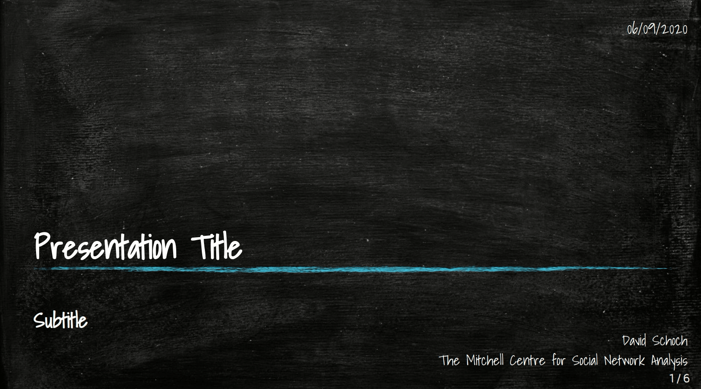
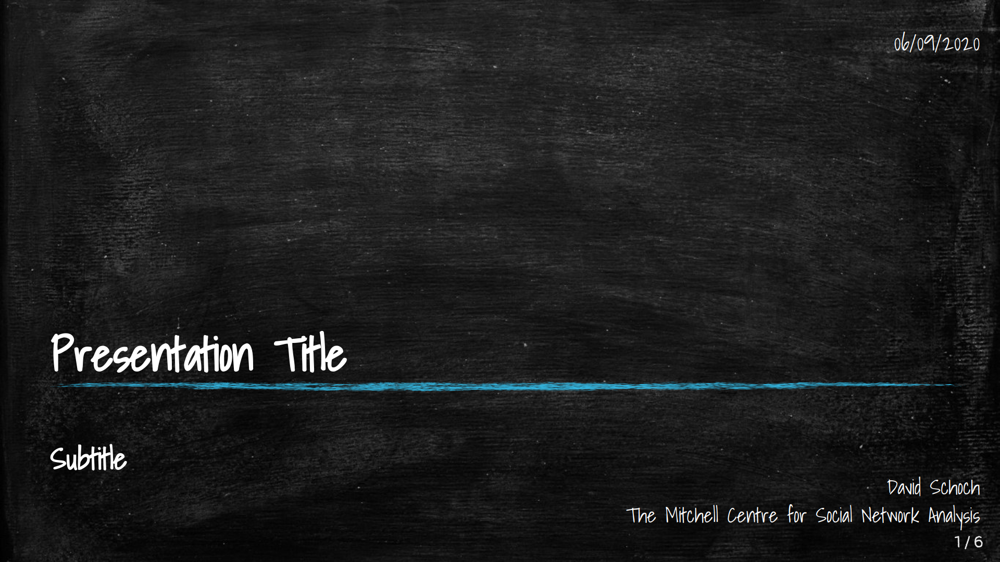
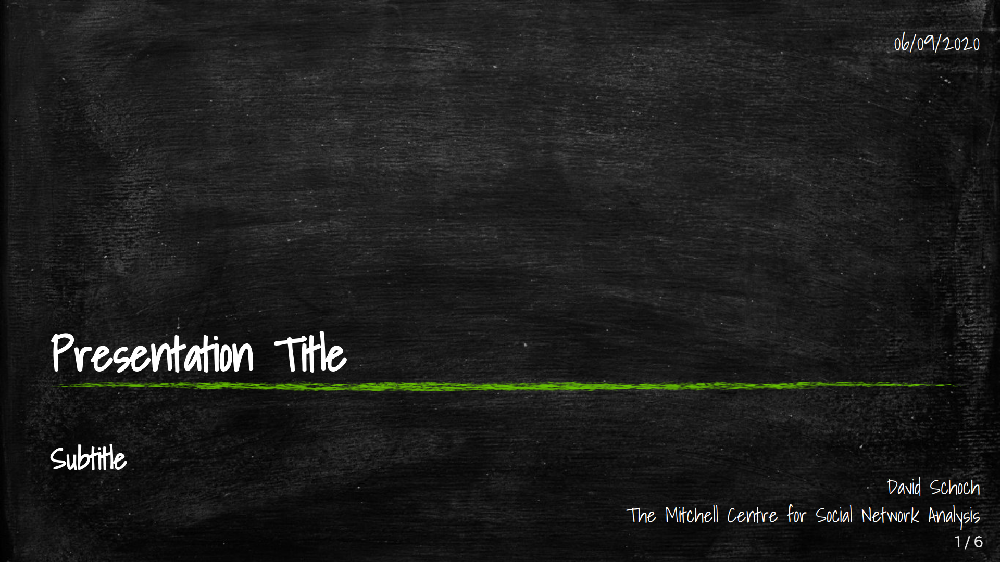
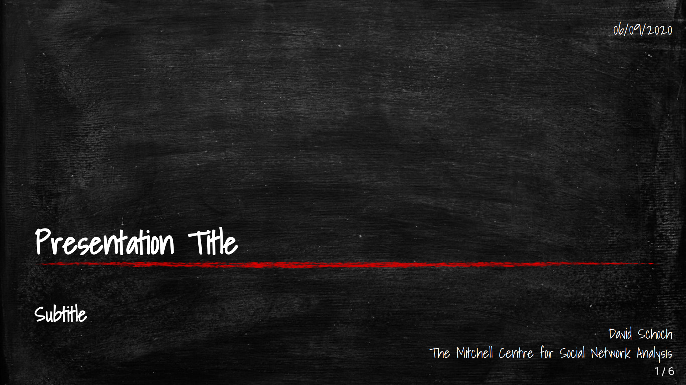
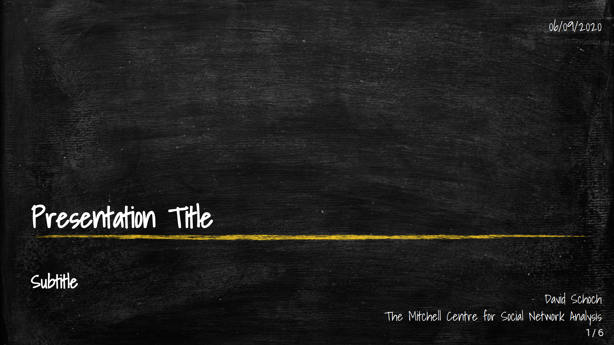
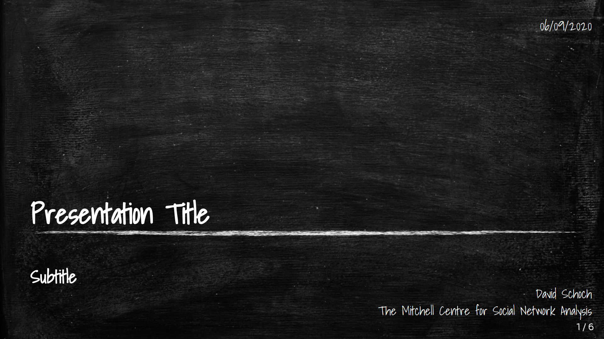
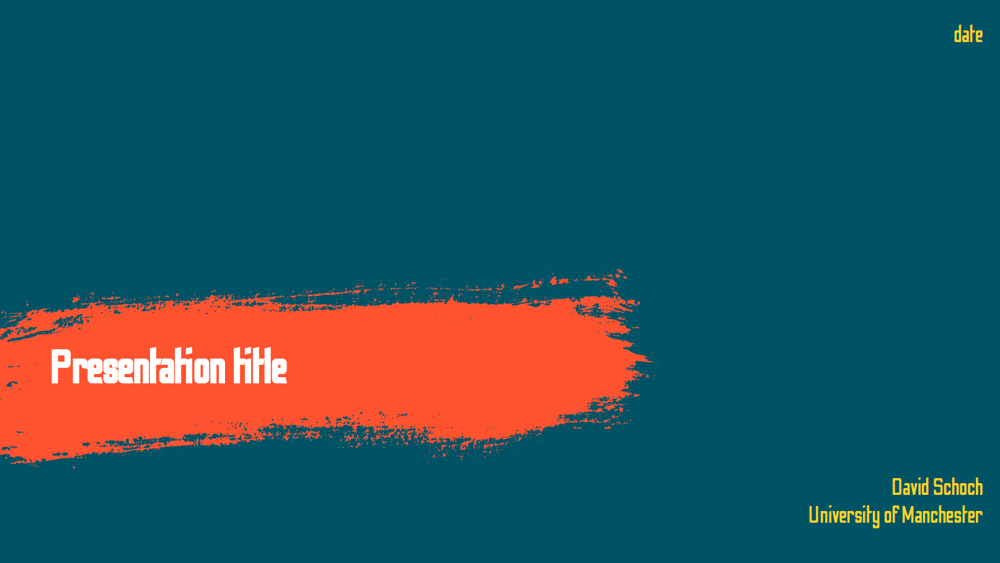
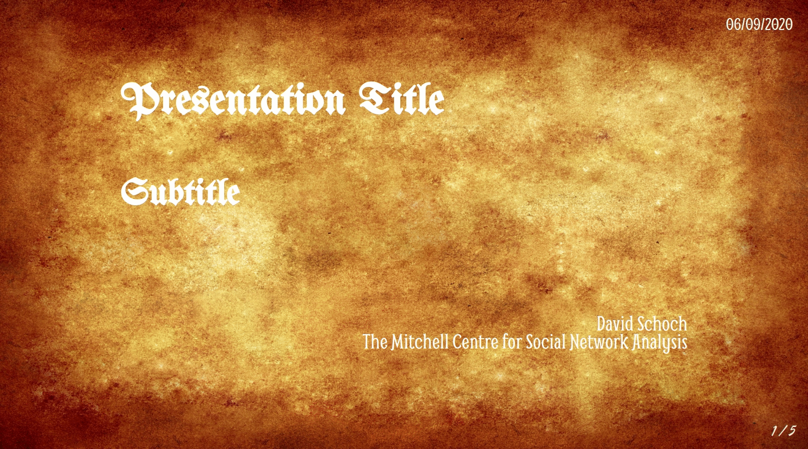

# xaringan themes

A collection of novelty themes for xaringan slides in R. 
The themes are not packaged. Simply clone the repository and use the `skeleton.Rmd` as a starting point.

# blackboard

A theme with a blackboard feeling.

The gif shows off all features (see the `skeleton.Rmd` file for code) 

change the css style sheet name to get different color themes.  

`css: "blackboard-blue.css"`

`css: "blackboard-green.css"`

`css: "blackboard-red.css"`

`css: "blackboard-yellow.css"`

`css: "blackboard-white.css"`

# paint

A "modern" paint style theme

# vintage

A worn paper/vintage theme

The gif shows off all features (see the `skeleton.Rmd` file for code) 

